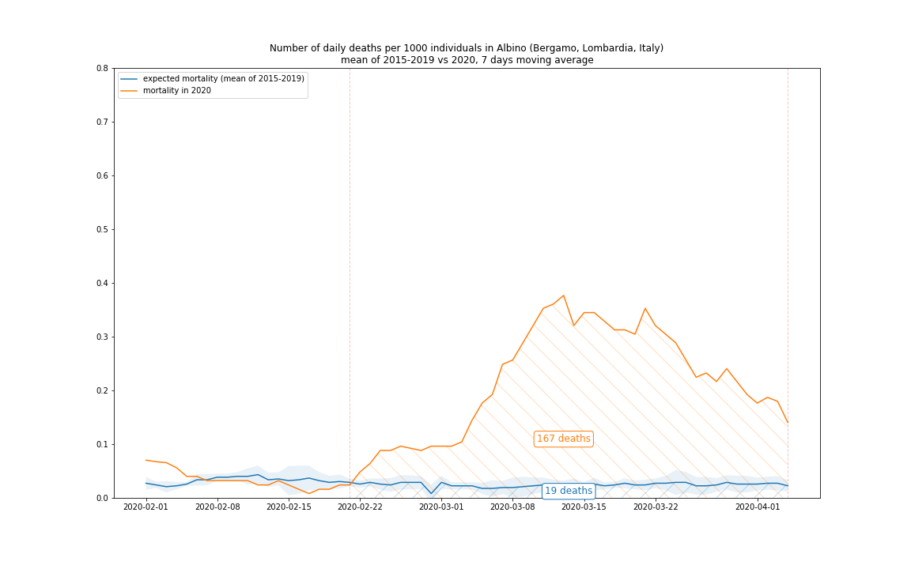
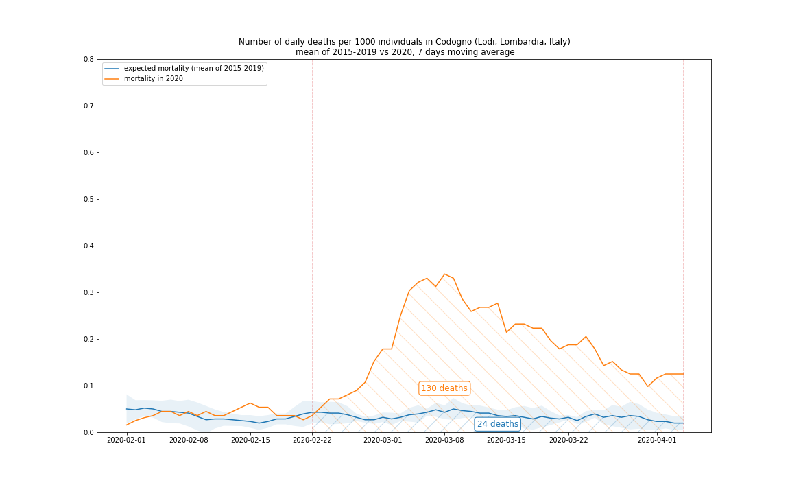
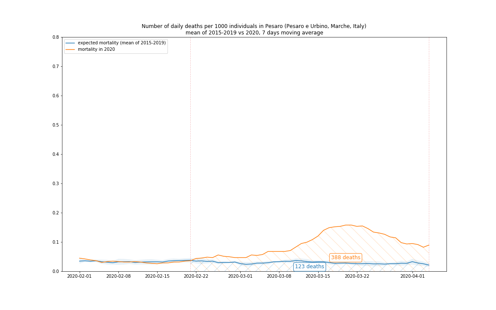

# How many people really die because of COVID-19 in Italy?

[First paragraph]

## History of publishing COVID-19 epidemic data in Italy

Italy was the first European country to be hit hard by the COVID-19 epidemic in the last days of February 2020. After the initial shock the authorities, particularly the [Civil Protection Department](http://www.protezionecivile.it) started to publish [daily bulletins](http://www.salute.gov.it/portale/nuovocoronavirus/dettaglioContenutiNuovoCoronavirus.jsp?id=5351&area=nuovoCoronavirus&menu=vuoto) about the number of infected persons, deaths and recoveries. A lot of worried epidemiologists, statisticians, data scientist and data enthusiasts started to write programs to crawl the bulletin webpage on a daily basis to save the day-to-day evolution of the epidemic, create time series that later could be analyzed. Others asked the government authorities to publish the same data also in a machine-readable way.

Several days later, at 7th of March, the Civil Protection Department created a [GitHub repository](https://github.com/pcm-dpc/COVID-19) with an extraordinary agility and they started to publish the daily updates of the epidemic data as well as historic time series in CSV and JSON format. The daily time series data is available on national and regional level for the number of infected, hospitalized (in ICU or not) and recovered people as well as the number of tests carried out that day and the deaths attributed to COVID-19. The total number of confirmed cases is available also on "comune" (municipality) level with daily updates. Making available the data with this level of details should be an exemplary transparency of the authorities.

## Reliability of the official data

Unfortunately it became clear soon that the methodology of the _collection_ of this data lacks the same exactitude of _publishing_ the data. This might be due to a number of facts. 

First, the Italian healthcare system and the **testing capacities were overwhelmed** in an unprecedented way within a couple of days after the beginning of the outbreak. They had simply no resources for systematic testing and reporting. 

Second, in Italy the **health services are fragmented** as they are managed on a regional level: in fact each region has its own healthcare system. These organizations interpret the government policies (for example about COVID-19 testing) in sightly different ways so they collect the data also in different ways. 

And at last, there might be **political reasons** not to change an established, nevertheless wrong data collection methodology. For example [China changed several times](https://edition.cnn.com/2020/02/21/health/coronavirus-reported-cases-covid-19-change-intl/index.html) its testing policy and on 12th February one such change resulted in a sudden jump in the positive cases. Almost all published diagrams showing the Chinese COVID-19 cases evolution note that the cause of this jump is a change in the methodology, but not all people read the small letter annotations. The risk that such a methodology change can cause confusion or even scare in the public is real.

### Testing only people reaching the hospital

During March representatives of national, regional and local authorities acknowledged the flaws of the COVID-19 epidemic data collection methods. As soon as 28 February Ministry of Health of Italy [decided not to count the asymptomatic cases](https://www.repubblica.it/cronaca/2020/02/28/news/cambia_il_metodo_di_conteggio_esclusi_i_positivi_asintomatici-249765660/) in the statistics even if they were tested positive. 

Several days after they decided to **do virology tests only for persons who have reached the hospital**, and stopped home testing at all because of capacity issues. After the first week of March the healthcare system at least in Lombardy became so overwhelmed that they could not provide hospital care even for some serious cases. In the emergency or even telephone triage factors like patient age and preexisting medical conditions were considered more and more aggressively. Only people with better prognosis could get hospitalization. 

In practice this meant that a number of elderly and vulnerable people **died at their home** because of pneumonia or heart failure. As home or post-mortem testing was not (and still not) available, these victims were never tested for COVID-19 and so they are invisible for the statistics. 

### Number of ICU cases capped on the number of beds

Having the hospital beds and especially the ICU beds capacity utilized near at 100% means also that **number of cases in hospital or ICU unit**  does not reflect the number of persons who actually have very serious conditions. These numbers are capped at the number of available places. Furthermore these time series reflect only a daily snapshot of the situation without the details of how many new patients are accepted in these structures and how many are discharged. 

### Multiple tests for the same patient counted separately

In late March it became evident that even the number of virology tests executed daily is practically useless for statistical analysis. This number contains _all_ tests evaluated that day. **For a single patient at least three tests are done**: the initial positive test and then at least two negative tests before they are considered recovered. Naturally even more than 3 tests can be also carried out for a single patient. Considering that only the total sum of the tests are included in the report, it is impossible to deduct which percentage of the tested people is actually positive. Not talking about that the results of the test (and so the inclusion of the result in the statistics) is delayed by an arbitrary number of 2-8 days after the sample was taken.

### Combined variable for "discharged" and "recovered" cases

At last we should talk about the time series in the statistics that is called "dimessi guariti" (discharged recovered). This number is commonly interpreted as the number people who had recovered from COVID-19, for example by the [Johns Hopkins University dashboard](https://coronavirus.jhu.edu/map.html) or by [Worldometer](https://www.worldometers.info/coronavirus/country/italy/). The trick of this naming is that it does not specify if we are speaking about "discharged _and_ recovered" or "discharged _or_ recovered" persons. Two NGO [tried to understand the real meaning](https://www.ilpost.it/2020/04/02/guariti-coronavirus-protezione-civile/) of this variable and independent healthcare sources confirm them that in fact it should be interpreted the second way: the number of **discharged _or_ recovered** persons. It might be a subtle difference but in fact it includes the number of persons who visited the hospital, tested positive for COVID-19 but then sent in home quarantine because they had mild conditions or because there were no available hospital beds for them. No follow up is provided for these cases: we do not know anything if and when they were really recovered, and typically no more testing is done for them.

### Regional differences

To make the situation even more confused, as mentioned above, **different regions interpret the government guidelines in different ways** so the methodology of data collection changes also from region to region. It is practically impossible to get a clear picture about the current epidemic situation looking at this data.

## Pursuing a reliable data source

After reading the above paragraphs you might ask: all right, but where can we get then reliable information about how is going the COVID-19 epidemic in Italy? Fortunately the [Italian National Institute of Statistics](https://www.istat.it) (ISTAT) publishes the mortality rate on a daily base for some of Italian municipalities. This service is used to measure the effect of the summer heat waves on the elderly population or to estimate the death tolls of the seasonal flu epidemics year after year. 

Confronting the mortality rate of 2020 with the baseline (the mean mortality rate for the same period in the last years) this demographic information *might* be used to estimate the approximate death toll for some extraordinary event, like the COVID-19 epidemic. Certainly people can die for any reason. But during the epidemic we see an extreme deviance from the expected mortality rate and it seems plausible to attribute the excessive mortality at least in part to the disease.

### Collecting the data

The daily mortality rate for the participating municipalities can be [downloaded](https://www.istat.it/it/files//2020/03/comune-giorno.zip) directly from the [dedicated webpage of ISTAT](https://www.istat.it/it/archivio/240401). This archive contains the number of deaths per day per comune of the first four months for the years 2015-2019 and from 1st January until 28th March for 2020, at the time of writing. If you want to calculate the divergence of the mortality rate for 2020 for a single comune that is included in the dataset, it is rather simple to take the average mortality rate for a given day of the proceeding years (some statisticians calls this "expected mortality") and compare it to the number of persons died the same day in 2020. 

This diagram shows the expected mortality and the actual mortality in Bergamo, one of the Italian municipalities that was hit particularly hard by the COVID-19 epidemic. (I used here a 7 days moving average with a central window to smooth out the daily fluctuations in the data.)

### Excess mortality rate on municipality level

The following diagrams shows the excess mortality during March 2020 in selected Italian municipalities. The blue line shows the daily expected mortality rate i.e. how many person died out of 1000 residents that day between 2015 and 2019. The 95% [confidence interval](https://en.wikipedia.org/wiki/Confidence_interval) is shown by the light blue stripe. The orange line shows the mortality rate for the same day in 2020. The area under the curves for the month of March are painted with a diagonal pattern: the size of these areas effectively tells us how many persons died in the whole month. The difference between these numbers is the excess mortality, most like to be attributed to COVID-19.

| municipiality   |   population | start&nbsp;date   |   expected mortality |   actual mortality | excess mortality rate   | image                                                                  |
|:----------------|-------------:|-------------:|---------------------:|-------------------:|------------------------:|:----------------------------------------------------------------------:|
| Nembro          |        11526 | 2020-02-20   |                   15 |                149 | 993%                    |      |
| Albino          |        17805 | 2020-02-21   |                   15 |                141 | 940%                    |      |
| Seriate         |        25385 | 2020-02-28   |                   16 |                123 | 769%                    |    |
| Codogno         |        15991 | 2020-02-22   |                   20 |                116 | 580%                    |    |
| Cremona         |        72680 | 2020-02-21   |                   87 |                342 | 393%                    |    |
| Pesaro          |        94969 | 2020-02-21   |                  103 |                324 | 315%                    |      |
| Piacenza        |       103942 | 2020-02-26   |                  117 |                417 | 356%                    |  |
| Tortona         |        27291 | 2020-03-01   |                   27 |                101 | 374%                    |    |

You can download the excess mortality values and rate during March 2020 for all Italian municipalities with available data from [here](data/excess_mortality_march_2020.csv). 

### Issues of geographic aggregations

Unfortunately the daily mortality data is available only for 1450 municipalities (out of 7904) of Italy. In these municipalities lives approximately 17.04 million persons (out of 60.36 million) that corresponds to 28% of the population of Italy. The data availability varies significantly between regions, for example in Lombardy 554 municipalities (out of 1506) provide the data that corresponds to 67% of the population. 

Because the mortality rate is not available for all municipalities in a given territory, we should find a way to estimate the mortality for the territory. We can not simple add the number of deaths for the municipalities where we have the data as it would heavily underestimate the real mortality. For the sake of simplicity (and because we do not have other data source) we will scale up the mortality data based on the rate of total population of the territory and the population of the municipalities in the territory that provided mortality data. This way we implicitly suppose that these municipalities are representative in their territory from the point of view of mortality, which is not necessarily true.

On the other hand the number of deaths officially attributed to COVID-19 is available on no lower than regional level, so we will estimate the mortality rate for the regions.

This table shows the population of the municipalities with mortality data available for each region and the percentage of this population of the total population of the region.

| region                |           pop. with data |  total pop. | rate   |
|:----------------------|-------------------------:|------------:|-------:|
| Lombardy              |                  6733446 |    10060574 | 67%    |
| Lazio                 |                   172113 |     5879082 | 3%     |
| Campania              |                   198997 |     5801692 | 3%     |
| Sicily                |                   332775 |     4999891 | 7%     |
| Veneto                |                  1652086 |     4905854 | 34%    |
| Emilia-Romagna        |                  2223875 |     4459477 | 50%    |
| Piedmont              |                  1414378 |     4356406 | 32%    |
| Apulia                |                   690710 |     4029053 | 17%    |
| Tuscany               |                  1030982 |     3729641 | 28%    |
| Calabria              |                    58593 |     1947131 | 3%     |
| Sardinia              |                   262664 |     1639591 | 16%    |
| Liguria               |                  1039816 |     1550640 | 67%    |
| Marche                |                   478153 |     1525271 | 31%    |
| Abruzzo               |                   170540 |     1311580 | 13%    |
| Friuli Venezia Giulia |                        0 |     1215220 | 0%     |
| Trentino-South Tyrol  |                        0 |     1072276 | 0%     |
| Umbria                |                   211428 |      882015 | 24%    |
| Basilicata            |                    35507 |      562869 | 6%     |
| Molise                |                    26577 |      305617 | 9%     |
| Aosta Valley          |                        0 |      125666 | 0%     |

 We will consider only the regions that have at mortality data available at least for the 30% of the population:
 
  - Lombardy
  - Veneto
  - Emilia-Romagna
  - Piedmont
  - Liguria
  - Marche
  
Incidentally these are the northern regions of Italy (with the exception of Marche) that were hit most seriously by the COVID-19 epidemic.
