# How many people really die connected to COVID-19 in Italy?

> This post is also published on [Medium](https://medium.com/@janos.tolgyesi/how-many-people-really-die-connected-to-covid-19-in-italy-e6facbf0c862).

At the end of February 2020 the [COVID-19 epidemic](https://en.wikipedia.org/wiki/2019–20_coronavirus_pandemic) was a shocking surprise for Italy, the first affected country in Europe. Very soon after the outbreak local authorities started to publish daily epidemic information including the number of confirmed cases and deaths. However after several weeks it became clear that the official data is flawed because of data collection methodology issues and other reasons.

In this analysis we make an attempt to estimate the real number of victims of the COVID-19 epidemic during March 2020 in several regions of Italy. We compare the daily mortalities in 2020 as reported by the Italian National Institute of Statistics to the same period of previous years. We will see that the real death toll of the epidemic is most likely several times underestimated by the official figures but also that the lockdown measures by local were effective.

## History of publishing COVID-19 epidemic data in Italy

Italy was the first European country to be hit hard by the COVID-19 epidemic in the last days of February 2020. After the initial shock the authorities, particularly the [Civil Protection Department](http://www.protezionecivile.it) started to publish [daily bulletins](http://www.salute.gov.it/portale/nuovocoronavirus/dettaglioContenutiNuovoCoronavirus.jsp?id=5351&area=nuovoCoronavirus&menu=vuoto) about the number of infected persons, deaths and recoveries. Worried epidemiologists, statisticians, data scientist and data enthusiasts started to write computer programs to automatically analyze the bulletin webpage on a daily basis. A lot of effort was dedicated to register the day-to-day evolution of the epidemic and to create time series that later could be analyzed. The government authorities were asked to publish the same data also in a machine-readable way.

Several days later, on 7th of March, the Civil Protection Department created a [GitHub repository](https://github.com/pcm-dpc/COVID-19) with an extraordinary agility and started to publish daily updates of the epidemic data as well as historic time series in CSV and JSON format. The daily time series data are currently available on national and regional level for the number of infected, hospitalized (in ICU or not), recovered people, as well as the number of tests carried out that day and the deaths attributed to COVID-19. The total number of confirmed cases is available also on "comune" (municipality) level. Making available the data with this level of details should be an exemplary transparency of the authorities.

## Reliability of the official data

Unfortunately it became clear very soon that the methodology of the _collection_ of this data lacks the same exactitude as of _publishing_ the data. This might be due to a number of facts. 

First, the Italian healthcare system and the **testing capacities were overwhelmed** in an unprecedented way within a couple of days after the beginning of the outbreak. They had simply no resources for systematic testing and reporting. 

Second, in Italy the [healthcare system is fragmented](https://en.wikipedia.org/wiki/Healthcare_in_Italy) as they are managed on a regional level: in fact each region has its own healthcare system. These organizations interpret the government policies (for example about COVID-19 testing) in sightly different ways so they collect the data also in different ways. 

And at last, there might be **political reasons** not to change an established, nevertheless wrong data collection methodology. [China changed several times](https://edition.cnn.com/2020/02/21/health/coronavirus-reported-cases-covid-19-change-intl/index.html) its testing policy and on 12th February one such change resulted in a sudden jump in the positive cases. Almost all published diagrams showing the Chinese COVID-19 cases note that the cause of this jump is a change in the methodology, but not all people read the small letter annotations. There is a real risk that such a methodology change can cause confusion or even scare in the public.

### Testing only people reaching the hospital

During March representatives of Italian national, regional and local authorities acknowledged the flaws of the COVID-19 epidemic data collection methods. As soon as 28 February Ministry of Health of Italy [announced that they will not count the asymptomatic cases](https://www.repubblica.it/cronaca/2020/02/28/news/cambia_il_metodo_di_conteggio_esclusi_i_positivi_asintomatici-249765660/) in future statistics even if they were tested positive. 

Several days later they decided to **do virology tests only for persons who have reached the hospital**, and stopped home testing at all because of capacity issues. After the first week of March the healthcare system at least in several territories of Lombardy became so overwhelmed that they could not provide hospital care even for some serious cases. In the emergency or even telephone triage factors like patient age and preexisting medical conditions were considered more and more aggressively. Only people with considerably good prognosis could get hospitalization. 

In practice this meant that a number of elderly and vulnerable people **died at their home** because of pneumonia or heart failure. As home or post-mortem testing was not available, these victims were never tested for COVID-19 and so they are invisible for the statistics. 

### Number of ICU cases capped at the number of beds

Having the hospital beds and especially the ICU beds capacity utilized near at 100% means also that **number of cases in hospital or ICU unit**  does not reflect the number of persons who actually needed it. These numbers are capped at the number of available places. Furthermore this data reflects only a daily snapshot of the situation without the details of how many new patients are accepted in these structures and how many are discharged. 

### Multiple tests for the same patient counted separately

In the same period it became evident that even the number of virology tests executed daily is practically useless for statistical analysis. This number contains _all_ tests evaluated that day. **For a single patient at least three tests are done**: the initial positive test and then at least two negative tests before they are considered recovered. Naturally even more than 3 tests can be also carried out for the same individual. Considering that only the total sum of the tests are included in the report, it is impossible to deduct which percentage of the tested people is actually positive. Not talking about that the results of the test (and so the inclusion of the result in the statistics) is delayed by an arbitrary number of 2-8 days after the sample was taken.

### Combined variable for "discharged" and "recovered" cases

At last we should talk about the variable in the official statistics that is called "dimessi guariti" (discharged recovered). This number is commonly interpreted as the number people who have recovered from COVID-19, for example by the [Johns Hopkins University dashboard](https://coronavirus.jhu.edu/map.html) or by [Worldometer](https://www.worldometers.info/coronavirus/country/italy/). The trick of this naming is that it does not specify if we are speaking about "discharged _and_ recovered" or alternatively "discharged _or_ recovered" persons. Two NGO [tried to understand the real meaning](https://www.ilpost.it/2020/04/02/guariti-coronavirus-protezione-civile/) of this variable and independent healthcare sources confirmed them that in fact it should be interpreted the second way: the number of **discharged _or_ recovered** persons. It might seem a subtle difference but this way the variable includes the number of persons who visited the hospital, tested positive for COVID-19 but then sent home to stay in quarantine at their place because they had mild conditions or because there were no available hospital beds for them. No follow up is provided for these cases: we do not know anything if and when they were really recovered, and typically no more testing is done for them.

### Regional differences

To make the situation even more confused, as mentioned above, **different regions interpret the government guidelines in different ways** so the methodology of data collection changes also from region to region. It is practically impossible to get a clear picture about the current epidemic situation looking at the official data, still even serious political decisions are done based on it.

## Pursuing a reliable data source

After reading the above paragraphs you might ask: all right, but where can we get reliable information about how is going the COVID-19 epidemic in Italy? Fortunately the [Italian National Institute of Statistics](https://www.istat.it) (ISTAT) publishes the mortality rate on a daily base for some of Italian municipalities. This service is used to measure the effect of the summer heat waves on the elderly population or to estimate the death tolls of the seasonal flu epidemics year after year. 

Confronting the mortality rate of 2020 with the baseline (the mean mortality rate for the same period in the last years) this demographic information *might* be used to estimate the approximate death toll for some extraordinary event, like the COVID-19 epidemic. Certainly people can die for any reason. But during the epidemic we see an extreme deviance from the baseline and it seems plausible to attribute the number of deaths in excess at least in part to the disease.

### Collecting the data

The daily mortality rate for the participating municipalities can be [downloaded](https://www.istat.it/it/files//2020/03/comune-giorno.zip) directly from the [dedicated webpage of ISTAT](https://www.istat.it/it/archivio/240401). This archive contains the number of deaths per day per comune (municipality) of the first four months for the years 2015-2019 and from 1st January until 28th March for 2020, at the time of writing. If we want to calculate the divergence of the mortality rate for 2020 for a single municipality, it is rather simple to take the average number of deaths for a given day of the proceeding years (some statisticians calls this "expected mortality") and compare it to the number of persons died the same day in 2020. 

The following diagram shows the expected mortality and the actual mortality in Bergamo, one of the Italian municipalities that was hit particularly hard by the COVID-19 epidemic. (We used here a 7 days moving average with a central window to smooth out the daily fluctuations in the data.)

### Excess mortality rate on municipality level

The following diagrams shows the excess mortality during March 2020 in selected Italian municipalities. The blue line shows the daily expected mortality rate i.e. how many person died out of 1000 residents that day between 2015 and 2019. The 95% [confidence interval](https://en.wikipedia.org/wiki/Confidence_interval) is shown by the light blue stripe. The orange line shows the mortality rate for the same day in 2020. The area under the curves for the month of March is filled with a diagonal pattern: the size of these areas effectively tells us how many persons died in the whole month. The difference of these numbers is the *excess mortality*, most like to be attributed to COVID-19, and the quotient of the same number is called *excess mortality rate*.

For different municipalities different "start date" was selected, i.e. when the 2020 mortality trend stepped out of the confidence interval of the previous years mortality.

| municip.   |   population |             start date |   expected mortality |   actual mortality |   excess rate |           date of peak |                                 figure                                 |
|:-----------|-------------:|-----------------------:|---------------------:|-------------------:|--------------:|-----------------------:|:----------------------------------------------------------------------:|
| Nembro     |        11526 | 2020‑02‑20 |                   17 |                161 |          947% | 2020‑03‑10 |      |
| Albino     |        17805 | 2020‑02‑21 |                   18 |                166 |          922% | 2020‑03‑13 |      |
| Seriate    |        25385 | 2020‑02‑28 |                   19 |                137 |          721% | 2020‑03‑19 |  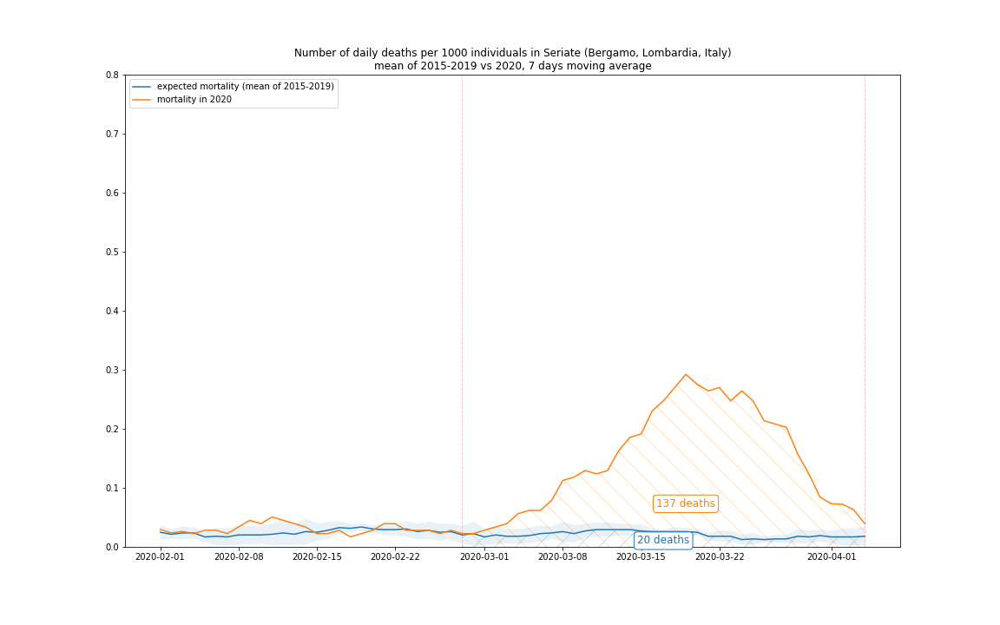  |
| Codogno    |        15991 | 2020‑02‑22 |                   23 |                130 |          565% | 2020‑03‑08 |    |
| Cremona    |        72680 | 2020‑02‑21 |                  102 |                407 |          399% | 2020‑03‑15 |  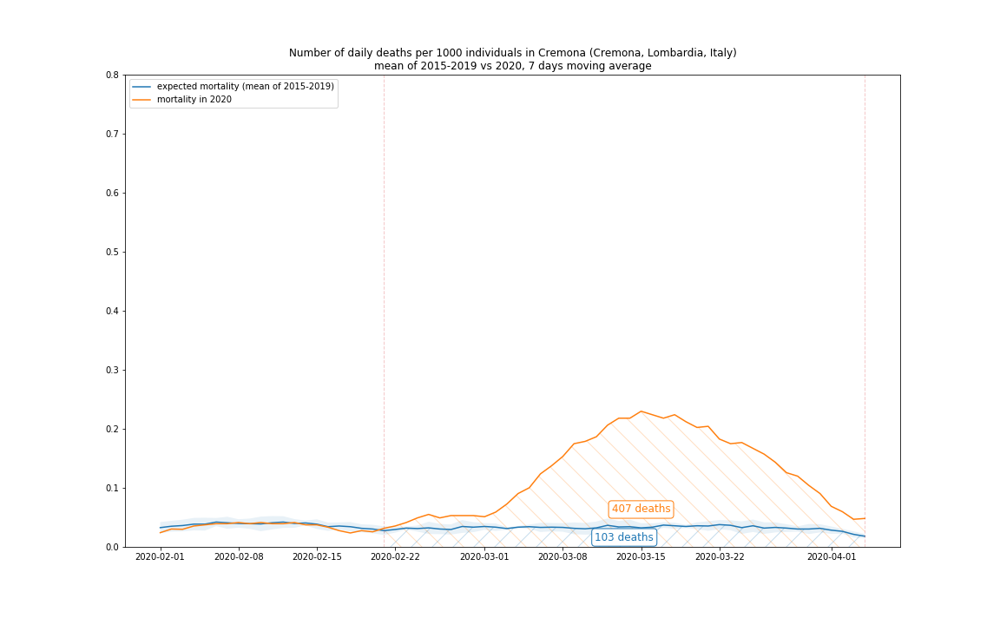  |
| Pesaro     |        94969 | 2020‑02‑21 |                  123 |                388 |          315% | 2020‑03‑20 |      |
| Piacenza   |       103942 | 2020‑02‑26 |                  141 |                512 |          363% | 2020‑03‑16 | 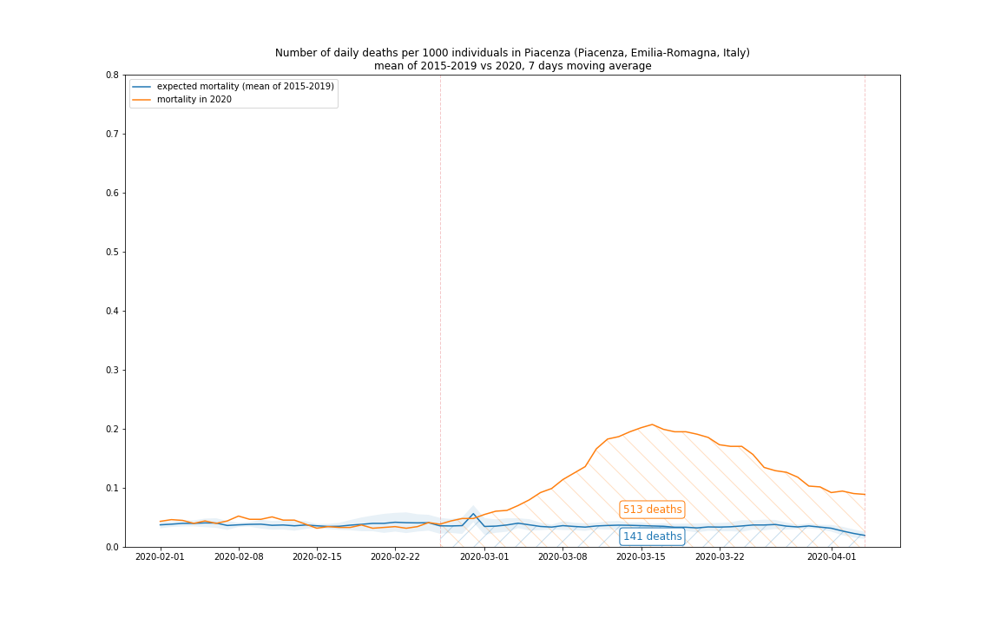 |
| Tortona    |        27291 | 2020‑03‑01 |                   34 |                121 |          356% | 2020‑03‑18 |  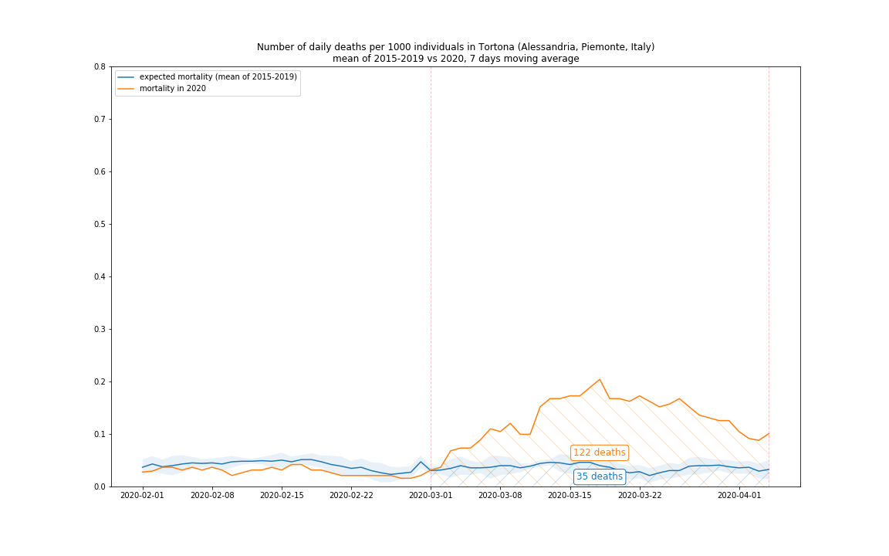  |
| Pavia      |        73086 | 2020‑03‑07 |                   66 |                141 |          214% | 2020‑03‑22 |    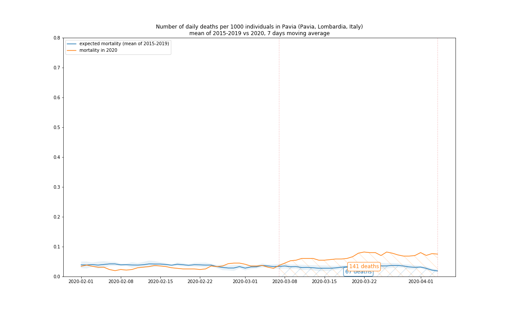    |
| Parma      |       196518 | 2020‑03‑07 |                  156 |                520 |          333% | 2020‑03‑20 |        |
| Brescia    |       198536 | 2020‑03‑07 |                  165 |                589 |          357% | 2020‑03‑20 |    |
| Milano     |      1378689 | 2020‑03‑07 |                 1085 |               1817 |          167% | 2020‑03‑24 |      |

You can download the excess mortality values and rate during March 2020 for all Italian municipalities with available data from [here](data/excess_mortality_march_2020.csv). 

### Issues of geographic aggregations

Unfortunately the daily mortality data is available only for 1450 municipalities (out of 7904) of Italy. In these municipalities live approximately 17.04 million persons (out of 60.36 million) that corresponds to 28% of the population of Italy. The data availability varies significantly between regions, for example in Lombardy 554 municipalities (out of 1506) provide the data that corresponds to 67% of the population. 

Because we do not have the mortality rate for all municipalities in a given region, we should find a way to estimate the mortality for the region. We can not simple add the number of deaths in the local municipalities with data available as it would heavily underestimate the real mortality. For the sake of simplicity (and because we do not have other data source) we will scale up the mortality data based on the quotient of the total population of the region and that one of the municipalities in the territory that provided mortality data. This way we implicitly suppose that these municipalities are representative in their region from the point of view of mortality, which is not necessarily true.

The population dataset of all Italian municipalities (as of 1st January 2019) can be [downloaded from ISTAT](http://dati.istat.it/Index.aspx?DataSetCode=DCIS_POPRES1). We will use this dataset to calculate the percentage of the population in the municipalities with daily mortality data available compared to the total population of the given region.

This table shows:
 - the population of the municipalities with mortality data available for each region, 
 - the mean and standard deviation of the mortality per 1000 persons in the municipalities, weighted by the municipality population,
 - and the percentage of this population to the total population of the region.

| region                |   pop. with data |   total pop. |   mean mortality |   std mortality |   rate |
|:----------------------|-----------------:|-------------:|-----------------:|----------------:|-------:|
| *Lombardia*           |          7252549 |     10060574 |         0.993688 |        0.349833 |    72% |
| *Liguria*             |          1071658 |      1550640 |         1.40127  |        0.281436 |    69% |
| *Emilia-Romagna*      |          2718973 |      4459477 |         1.12105  |        0.281772 |    61% |
| *Veneto*              |          2002736 |      4905854 |         0.956235 |        0.285533 |    41% |
| *Piemonte*            |          1693222 |      4356406 |         1.21317  |        0.303251 |    39% |
| Marche                |           513284 |      1525271 |         1.1562   |        0.182859 |    34% |
| Toscana               |          1174102 |      3729641 |         1.20464  |        0.284194 |    31% |
| Umbria                |           211428 |       882015 |         1.08825  |        0.19936  |    24% |
| Sardegna              |           388492 |      1639591 |         0.933058 |        0.250507 |    24% |
| Puglia                |           749628 |      4029053 |         0.970157 |        0.160312 |    19% |
| Abruzzo               |           170540 |      1311580 |         1.1116   |        0.266636 |    13% |
| Molise                |            26577 |       305617 |         1.08042  |        0.317319 |     9% |
| Basilicata            |            46649 |       562869 |         1.28498  |        0.413294 |     8% |
| Sicilia               |           361721 |      4999891 |         1.07068  |        0.330909 |     7% |
| Calabria              |            98955 |      1947131 |         1.05185  |        0.347759 |     5% |
| Campania              |           258209 |      5801692 |         0.896063 |        0.263229 |     4% |
| Lazio                 |           184596 |      5879082 |         0.993831 |        0.166596 |     3% |
| Friuli Venezia Giulia |                0 |      1215220 |         0        |        0        |     0% |
| Trentino-Alto Adige   |                0 |      1072276 |         0        |        0        |     0% |
| Valle d'Aosta         |                0 |       125666 |         0        |        0        |     0% |

We will consider only the regions that have at mortality data available at least for the 30% of the population. These regions are written with  italic font in the table above.
  
Incidentally these are the northern regions of Italy (with the exception of Marche) that were hit most seriously by the COVID-19 epidemic.

### Number of victims officially attributed to COVID-19

The number of deaths officially attributed to COVID-19 is available on no lower than regional level, so we will estimate the mortality rate for the regions. This dataset can be accessed from the [GitHub repository](http://github.com/pcm-dpc/COVID-19) of the Civil Protection Department.

## Results

The following figure shows the daily excess mortality (calculated subtracting the expected mortality from the actual mortality in 2020) and the number of deaths officially attributed to COVID-19 in March 2020, for the region of Lombardy:

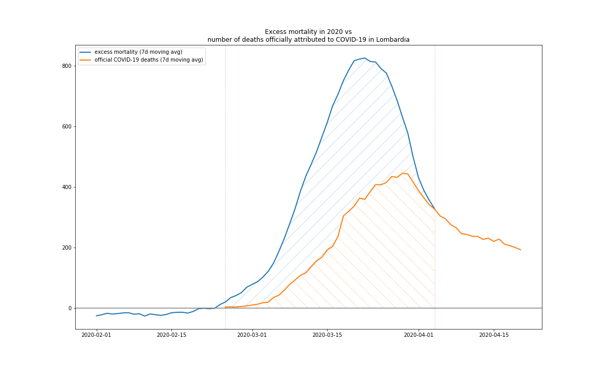

In the following table we list the estimated excess mortalities on a region level for March 2020 (since at the time of the writing official data will not be available) and compare it to the official number of COVID-19 victims. 

| region         |   excess mortality |   official COVID-19 deaths |   rate |           date of peak |                                                     figure                                                     |
|:---------------|-------------------:|---------------------------:|-------:|-----------------------:|:--------------------------------------------------------------------------------------------------------------:|
| Lombardia      |              17917 |                       8650 |   207% | 2020‑03‑22 |            |
| Veneto         |               2235 |                        605 |   369% | 2020‑03‑23 |         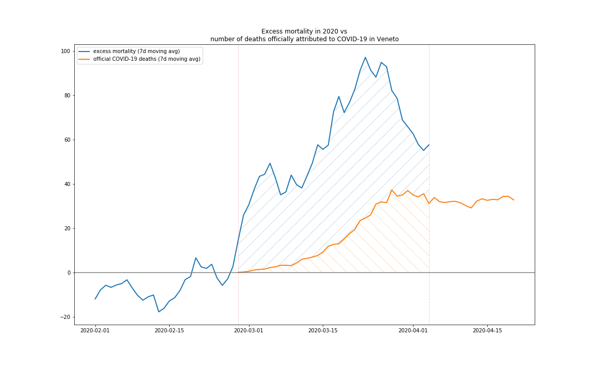         |
| Emilia-Romagna |               4845 |                       1977 |   245% | 2020‑03‑21 | 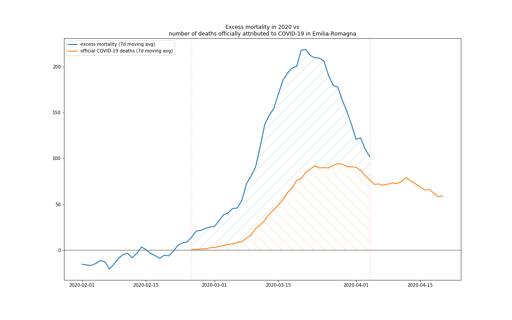 |
| Piemonte       |               4012 |                       1128 |   356% | 2020‑03‑25 |       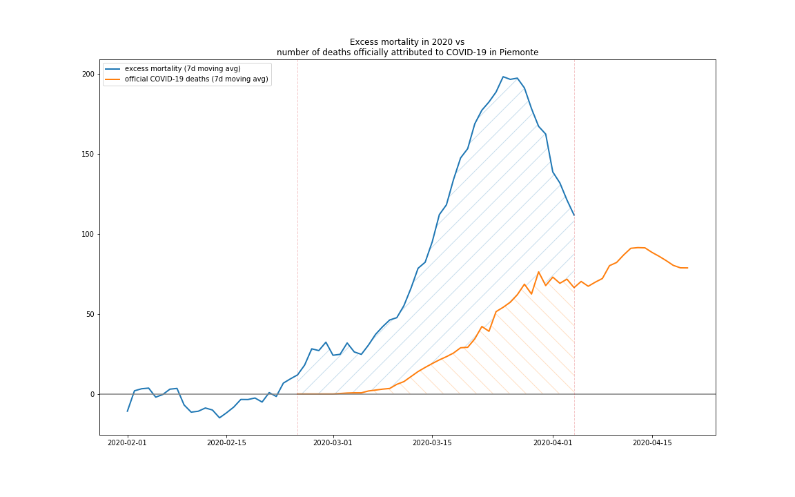       |
| Liguria        |               1093 |                        542 |   202% | 2020‑03‑21 |        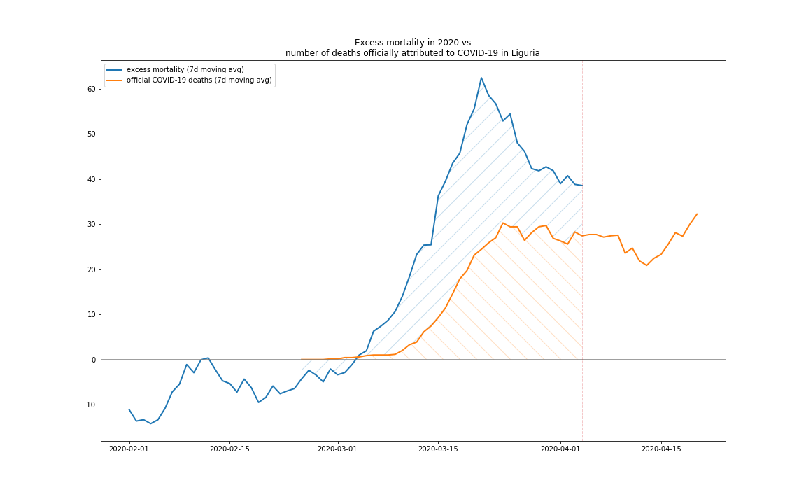        |
| Marche         |               1657 |                        574 |   289% | 2020‑03‑21 |         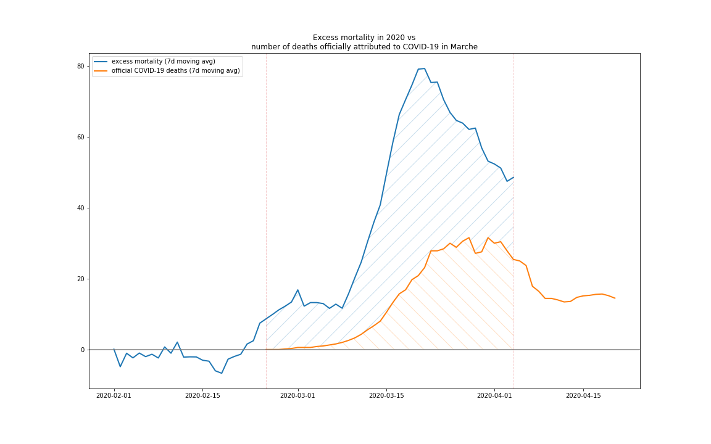         |

It is also worth to pay attention to the "start date" in the table of the sampled municipalities. This date shows when the actual mortality stepped out from the confidence interval of the expected mortality and started to trend upwards. According to the [Italian National Institute of Health](https://www.epicentro.iss.it/coronavirus/) the median time from the onset of symptoms to the eventual deaths is 10 days. The most commonly cited incubation period of COVID-19 is 6-7 days. Subtracting the median incubation period and duration of illness from these dates suggests that the coronavirus disease was widely spread as early as the first days of February 2020 at least in some provinces of Lombardy (for example in Bergamo, Cremona, Pesaro and Lodi). The first endemic cluster was identified only on [21st February](https://en.wikipedia.org/wiki/2020_coronavirus_pandemic_in_Italy) in the city Codogno (province of Lodi).

Let's have a closer look at the "date of peak" column in both tables of municipalities and regions. As we mentioned above, the first site of the epidemic onset included Codogno and surrounding municipalities. In this area the authorities immediately (the same day of 21st February) [enforced a lockdown](https://en.wikipedia.org/wiki/2020_Italy_coronavirus_lockdown#Initial_lockdowns) effectively prohibiting the people to leave their house without serious reason. If we add to this date the median duration of 16-17 days from the infection to the eventual death, we get 8th of March which corresponds exactly to the peak of the mortality in Codogno. 

On 8th March the quarantine zone was expanded to cover much of northern Italy and on the next day to the whole national territory. Approximately two weeks later, around 20-22 March the mortality in other areas started to decrease as well. 

We can conclude that the two main takeaway of this analysis are:

1. There is a huge number of excessive deaths not explained by the official figures. Most likely the number of COVID-19 victims in Italy is heavily underestimated.
2. The measures of lockdown imposed by the authorities, from the point of view of stopping the growth of the number of victims, were effective.

Written by [@jtolgyesi](http://twitter.com/jtolgyesi)
