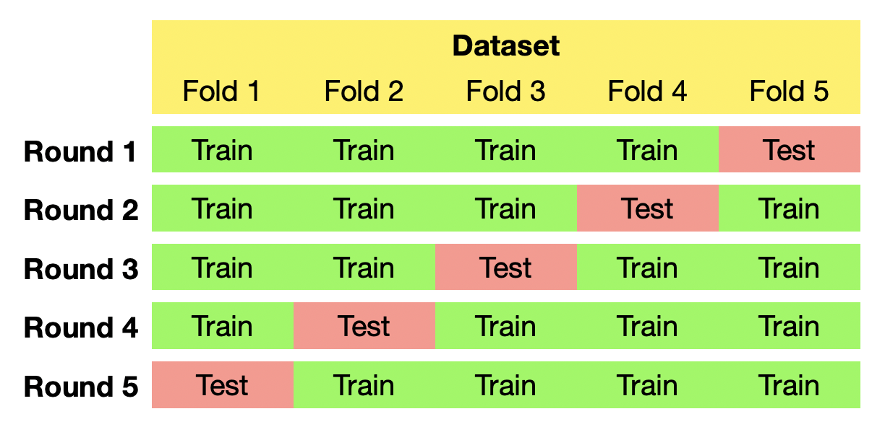
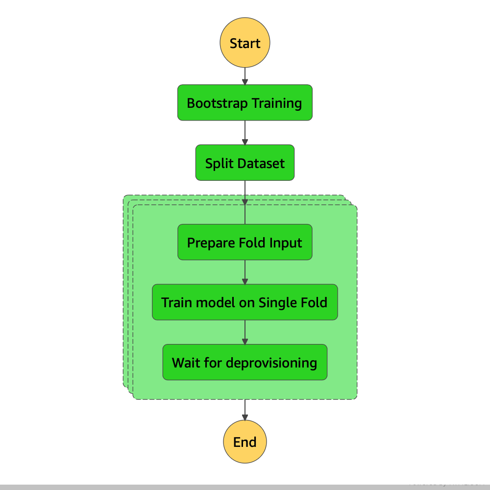

# Cross-validate your machine-learning model with SageMaker and Step Functions

> Automatize cross-validated machine-learning training jobs on AWS infrastructure

  
*Image by [TeeFarm](https://pixabay.com/users/teefarm-199315/?utm_source=link-attribution&amp;utm_medium=referral&amp;utm_campaign=image&amp;utm_content=3758346) from [Pixabay](https://pixabay.com/?utm_source=link-attribution&amp;utm_medium=referral&amp;utm_campaign=image&amp;utm_content=3758346)*

Cross-validation is a powerful technique to build  machine learning models that perform well on unseen data. However it can be also time consuming as it includes training multiple models. In this post I will show you how to easily cross-validate a machine-learning model using several services of Amazon Web Services (AWS) including SageMaker, Step Functions and Lambda.

## Why do you need cross-validation?

> If you know the concept of cross-validation feel free to jump directly to section introducing [SMX-Validator](#smx-validator).

### The problem of small datasets and sample distribution

Imagine the antelopes of the savanna entrust you to train an image classifier model that helps them to recognize jaguars in a picture. They give you 50 photos of a jaguar and 50 photos of the savanna with no jaguars. You divide the dataset into a training set of 80 photos and a test set of 20 photos, taking care that in each set there would be equal number of jaguar and non-jaguar photos. You train your model with your favorite image classifier algorithm and get an impressive validation accuracy of 100%. 

As a visual check, you look at some correctly classified photos in the test set:

  
*Image by [Mark Murphy](https://pixabay.com/users/markmurphy-10772193/?utm_source=link-attribution&amp;utm_medium=referral&amp;utm_campaign=image&amp;utm_content=4112011) from [Pixabay](https://pixabay.com/?utm_source=link-attribution&amp;utm_medium=referral&amp;utm_campaign=image&amp;utm_content=4112011)*

Everything looks good.

Some time later you retrain your model. You split the same dataset again into 80% train - 20% test sets, use exactly the same hyperparameters that you used for the first model, and get a validation accuracy of 80%, with a couple of false negatives (lethal for the antelopes!). So what has happened?

You look at the false negatives in the test set and find photos like this:

  
*Photo by [Senthiaathavan](https://commons.wikimedia.org/wiki/File:Camouflaged_Sri_Lankan_leopard_(Panthera_pardus_kotiya).jpg) on [Wikimedia Commons](https://commons.wikimedia.org/wiki/Main_Page)*

It is obvious that there are "easier" and "harder" examples in your dataset. When you split your dataset into the train/test sets, your goal is always that the *test set would be a good representative of the whole data*. Talking about class distribution you can enforce this using stratified split strategy, but what about sample "hardness" it is a much more difficult task. Especially if you have a small dataset you could easily get a split where all "hard" samples finish in the training set, so your test set will contain only "easy" samples and thus lead to a good test score. On the other hand if most "hard" examples will be placed in the test set, you will get a worse result using a model trained with exactly same hyperparameters.

### Hyperparameter optimization

An other very important case is when you are tuning the hyperparameters of your model. In case of [*hyperparameter optimization*](https://en.wikipedia.org/wiki/Hyperparameter_optimization) you iteratively modify some hyperparameter of the model, retrain it with the same training set and check the performance on the validation set. If the model performs better since the last training, you know that the hyperparameter adjustment was likely in the correct direction so you have a clue on how to continue with the tuning. 

  
*Image by [Niklas Ahrnke](https://pixabay.com/users/niklas_ahrnke-10296613/?utm_source=link-attribution&amp;utm_medium=referral&amp;utm_campaign=image&amp;utm_content=3721929) from [Pixabay](https://pixabay.com/?utm_source=link-attribution&amp;utm_medium=referral&amp;utm_campaign=image&amp;utm_content=3721929)*

The problem with this approach is that some information is leaking from the validation set to the training process. As the hyperparameter update step depends on how well the model performs on the validation set, you might end up with a hyperparameter set (and model) that is optimized for *that particular validation set* and not for the generic case. The simplest solution to this problem is to divide your dataset to three partitions: [training, validation and test sets](https://en.wikipedia.org/wiki/Training,_validation,_and_test_sets), tune your model with the training and validation set, and get the final performance metrics with the completely unseen test set. Unfortunately this means even less samples to be used for training as you would split your dataset for example into 60%-20%-20% sized train-validation-test splits.

### Other reasons

There are some other scenarios when cross-validation can be particular useful, for example:

 - when your dataset contains interdependent data points, 
 - or when you plan to stack up machine learning models so that the input of one model is the prediction output of the previous model.

For a detailed discussion of these cases check out [this article](https://towardsdatascience.com/5-reasons-why-you-should-use-cross-validation-in-your-data-science-project-8163311a1e79).

## How can cross-validation help?

[*Cross-validation*](https://en.wikipedia.org/wiki/Cross-validation_(statistics)) is a group of techniques to asses how well your model can generalize for unseen data. The standard train-test split of the dataset can be thought as one round of a cross-validation process. Indeed most cross-validation strategies use multiple rounds to split the dataset into different partitions, train different models and then assess their combined performance.

One of the most often used cross-validation strategy is called *k-fold cross-validation*. Wikipedia gives a [precise definition](https://en.wikipedia.org/wiki/Cross-validation_(statistics)#k-fold_cross-validation) of what it is:

> In k-fold cross-validation, the original sample is randomly partitioned into k equal sized subsamples. Of the k subsamples, a single subsample is retained as the validation data for testing the model, and the remaining *k&nbsp;−&nbsp;1* subsamples are used as training data. The cross-validation process is then repeated k times, with each of the k subsamples used exactly once as the validation data. The k results can then be averaged to produce a single estimation.

For example, if you use 5-fold cross-validation, you will train 5 different model using the following splits:

  
*Illustration by the author*

In the jaguar classification example above the "hard" sample will turn up in the test set of one training round and in the training set of the other four rounds. Examining the accuracy of all five models will give you a better overall picture of how your model will perform on unseen dataset. At the same time you've used all available data to train and validate your model.

This all sounds good but it means that you have to execute the following additional steps before training your model:

 - split the dataset into 5 folds,
 - assemble the splits into the training sets and test set of the 5 training rounds,
 - schedule the training of each machine learning models on the available hardware, and 
 - collect the training metrics from each training jobs. 

This is a considerable overhead to deal with, especially if you need to train your model regularly.

Here comes into play SMX-Validator.

## SMX-Validator

SMX-Validator is an application directly deployable to AWS infrastructure that manages the cross-validated training of almost any supervised machine learning model that you can train with SageMaker.

The application is built upon several AWS services:

 - [Amazon SageMaker](https://aws.amazon.com/sagemaker/) is a cloud machine-learning platform that enables developers to create, train, and deploy machine-learning (ML) models in the AWS cloud. 
 - [AWS Step Functions](https://aws.amazon.com/step-functions/) is a serverless function orchestrator and state machine implementation that can be used to sequence AWS Lambda functions and other AWS services, including SageMaker.
 - [AWS Lambda](https://aws.amazon.com/lambda/) is a serverless computing platform that can be used to run code in response to events, for example in response to a SageMaker "training finished" event. It also automatically manages the computing resources to run that code.
 - [Amazon S3](https://aws.amazon.com/s3/) is an object storage service that allows storing data in the cloud with a filesystem-like interface.

 After deploying SMX-Validator to your AWS account, you specify a machine learning training template, an input dataset and the number of folds you wish to train. The application will automatically orchestrate all training jobs, execute them possibly in parallel and report you back the results and performance of each training job. Follow along to train your first cross-validated job with SMX-Validator. In this walkthrough we will use an image classification task as an example.

 ### Prerequisites

 1. You will need an AWS account. If you don't have one yet, open a [new one](https://aws.amazon.com/premiumsupport/knowledge-center/create-and-activate-aws-account/).
 2. AWS offers a [free tier](https://aws.amazon.com/free/) for new account. However GPU instances (highly recommended for training image classifiers) are not included so you should expect some training costs, in the order of magnitude of a several USDs.
 3. A dataset that you want to train on. In the [Prepare your data](#prepare-your-data) section below I will describe how to get a dataset if you don't have already one.
 4. SMX-Validator is a [Serverless Application Model (SAM)](https://docs.aws.amazon.com/serverless-application-model/latest/developerguide/what-is-sam.html) application. You can [deploy it directly](https://serverlessrepo.aws.amazon.com/applications/eu-west-1/043458249825/SMX-Validator) from the [Serverless Application Repository (SAR)](https://aws.amazon.com/serverless/serverlessrepo/) or you can build it manually with the [SAM Command Line Interface (CLI)](https://docs.aws.amazon.com/serverless-application-model/latest/developerguide/serverless-sam-cli-install.html) and deploy it to your AWS account. If you choose manual installation you should install the SAM CLI with Docker and setup your AWS credentials as described in the documentation.

### Supported SageMaker algorithms and containers

You can use any supervised training container with SMX-Validator that accepts a newline separated file as input, for example:
 - Linear Learner with [CSV input format](https://docs.aws.amazon.com/sagemaker/latest/dg/linear-learner.html#ll-input_output)
 - K-Nearest Neighbors Algorithm with [CSV input format](https://docs.aws.amazon.com/sagemaker/latest/dg/k-nearest-neighbors.html#kNN-input_output)
 - Image Classification Algorithm with [Augmented Manifest Image Format](https://docs.aws.amazon.com/sagemaker/latest/dg/image-classification.html#IC-augmented-manifest-training)
 - XGBoost Algorithm with [CSV input format](https://docs.aws.amazon.com/sagemaker/latest/dg/xgboost.html#InputOutput-XGBoost)
 - BlazingText in Text Classification mode with [File Mode or Augmented Manifest Text Format](https://docs.aws.amazon.com/sagemaker/latest/dg/blazingtext.html#blazingtext-data-formats-text-class)
 - your custom training container that accepts newline separated files as input.

### Prepare your data

In this tutorial we will use a binary image classification dataset. If you don't have one, you can use the famous [dogs-vs-cats](https://www.kaggle.com/c/dogs-vs-cats) dataset. Download the dataset from Kaggle to a directory on your computer. [Create also an S3 bucket](https://s3.console.aws.amazon.com/s3/bucket/create) and upload all images files to the bucket.

To be able to use SMX-Validator with SageMaker Image Classification we'll have to organize the dataset metadata into a [Augmented Manifest Image Format](https://docs.aws.amazon.com/sagemaker/latest/dg/image-classification.html#IC-augmented-manifest-training) file. Assuming you use the Dogs vs Cats dataset, this python snippet should do the job:

```python
import glob
remote_s3_prefix = 's3://my_bucket/dogs_vs_cats/'
with open('manifest.jsonl', 'w') as f:
    for img in glob.glob('*.jpg'):
        lbl = 0 if img.startswith('dog') else 1
        f.write('{{"source-ref":"s3://my_bucket/dogs_and_cats/{}", "class":"{}"}}\n'\
            .format(img, lbl))
```

Remember to change `my_bucket/dogs_vs_cats` to the bucket name and prefix of your input dataset location. This script will assign the class id `0` for dogs and `1` for cats. Upload also the created `manifest.jsonl` to the input bucket. 

### Deploy SMX-Validator

[SMX-Validator is published on AWS SAR](https://serverlessrepo.aws.amazon.com/applications/eu-west-1/043458249825/SMX-Validator). The simplest way to deploy the application is clicking the "Deploy" button on the application page. You will be asked to fill out two parameters before deploying the application:

- `InputBucketName`: the name of the S3 bucket where you uploaded your dataset. At deployment time an [IAM Role](https://docs.aws.amazon.com/IAM/latest/UserGuide/id_roles.html) will be created that allows the application to read data from this bucket.
- `OutputBucketName`: the name of an S3 bucket where the application can write partial results and working data. Reading and writing data to this bucket will be granted to the application via the IAM role above.

You might want to create these two buckets before deploying the application. You should also acknowledge that the app will create custom IAM roles. These roles enable the application to start SageMaker training jobs and to read/write from/to the above buckets.

Alternatively you can clone the git repo of SMX-Validator and build the application with the [SAM-CLI](https://docs.aws.amazon.com/serverless-application-model/latest/developerguide/serverless-sam-cli-install.html). Follow the [readme in the project repository](https://github.com/mrtj/smx-validator) for details.

### Start a cross-validated training

SM-Validator deploys a Step Functions state machine that orchestrates the training of the cross-validated folds. You can start a cross-validated job launching a new execution of the state machine.

You should specify some input parameters of the cross-validated training job in a json file, like:

 - the S3 path of the input `manifest.jsonl`,
 - the output path (these paths should point to the buckets you specified at application deploy time), 
 - the name of the cross-validated training job, 
 - the number of folds, and 
 - a SageMaker training job template including training hyperparameters and resource configuration. 
 
You can find the input schema specification, a detailed documentation and a complete example of an input file in the documentation of SMX-Validator.

Once you created your input json file, you have different options to start the execution of the state machine:

1. Using the the [AWS CLI](https://docs.aws.amazon.com/cli/latest/reference/stepfunctions/start-execution.html):
    ```bash
    aws stepfunctions start-execution \
        --state-machine-arn {CrossValidatorStateMachineArn} \
        --input file://my_input.json
    ```
2. From the [AWS Step Functions web console](https://console.aws.amazon.com/states/home#/statemachines) select the `CrossValidatorStateMachine-*` and on the state machine page click the "Start execution" button. Copy the contents of your input json into the Input text area.

3. Using the [AWS SDKs](https://aws.amazon.com/tools/), from a local script or from a lambda function.

SMX-Validator will split the input dataset into folds, assemble the training and test sets and launch *k* training jobs possibly in parallel. The number of concurrently executed jobs is specified in the state machine specification file (by default two) and can be adjusted to the number of available ml-instances in your AWS account. The diagram below illustrates the state machine of SMX-Validator. The steps in the light green boxes are executed concurrently.

  
*Illustration by the author*

### Training jobs

SMX-Validator will launch a SageMaker training job for each cross-validated training rounds. The number of splits (and the training jobs) you define in the `crossvalidation.n_splits` parameter. The training jobs will be named based on the following template:

```
crossvalidator-{input.job_config.name}-{YYYYMMDD}-{HHMMSS}-fold{fold_idx}
```

where `{input.job_config.name}` is the job name from the input configuration, `{YYYYMMDD}-{HHMMSS}` is the timestamp at the start job and `{fold_idx}` is the zero-based index of the round.

You can find all training jobs launched by SMX-Validator in the [SageMaker Training Jobs](https://console.aws.amazon.com/sagemaker/home#/jobs) console. On the page of a single training job you can find the diagram of the training and validation metrics during the training , as well as the final metric values.

The details of the training jobs will be reported also in the Step Functions execution output json. This json will contain the following fields:

- `job_config`: Parameters of generic for the whole cross-validated training job, like job name, SageMaker Experiment and Trial name, job input and output data.
- `crossvalidation`: Cross-validation parameters, like number of splits used in the job.
- `training`: The template structures used to create the training jobs.
- `splits`: This array contains the detailed results of each training job. It corresponds to the output of the `DescribeTrainingJob` SageMaker API call. Other than the exact training job inputs you can find the training time and duration, billable seconds, final metrics value and output artifacts location in this structure.

## Conclusion

Cross-validating a machine learning model is a powerful tool in the toolset of every data scientist. It can help you to efficiently assess models trained on a small dataset, in the case the dataset contains variable samples of variable "difficulty", if you are optimizing model hyperparameters. However training multiple models on limited hardware resources can be time consuming and needs manual orchestration. SMX-Validator helps to train k-fold cross-validated machine learning models on AWS infrastructure, taking care of the heavy-duty task orchestration of the training jobs.
